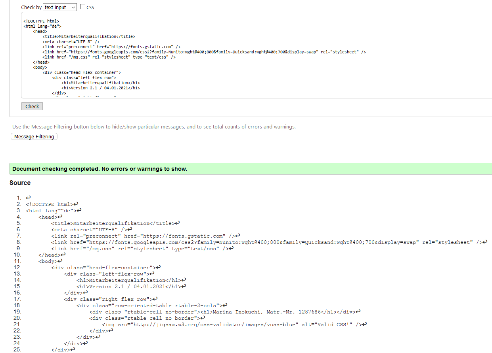

---
title: Mitarbeiterqualifikation-Doku
...

Dieses Projekt wurde von Marina Inokuchi (Matr-Nr. 1287686) bearbeitet. Letztes Bearbeitungsdatum: 04.01.2021.

# 1. Dateistruktur #

Die Webanwendung besteht aus folgenden Dateien (Ordner werden kursiv dargestellt):

- server.py
- access.log
- server.log
- *app*
  - application.py
  - database.py
  - dataid.py
  - validator.py
  - view.py
- *content*
  - mq.js
  - mq.css
- *data*
  - maxid.json
  - employee.json
  - training.json
- *templates*
  - base.tpl
  - evaluation_certificates.tpl
  - evaluation_employees.tpl
  - evaluation_trainings.tpl
  - form_employee.tpl
  - form_qualification.tpl
  - form_training.tpl
  - index.tpl
  - list_employees.tpl
  - list_trainings.tpl
  - participation_employee.tpl
  - participation_employees.tpl
  - participation_training_finished.tpl
  - participation_training_ongoing.tpl
  - participation_trainings.tpl
  - show_employee.tpl
  - show_training.tpl

# 2. Beschreibung der Lösung #

## 2.1. Aufgabe der Anwendung ##

Die Aufgabe der Anwendung ist es, die Teilnahme von mehreren Mitarbeitern an verschiedenen Weiterbildungen zu organisieren. Zusätzlich sollen auch Zertifikate und Qualifikationen, die aus erfolgreichen Teilnahmen an den Weiterbildungen resultieren, den Mitarbeitern zugeordnet werden können.

## 2.2. Übersicht der fachlichen Funktionen ##

### 2.2.1. Erfassen/Ändern von Daten ###

Um dieses Ziel zu erreichen, können zunächst sowohl Mitarbeiter als auch Weiterbildungen erfasst werden.
Mitarbeiter werden mit folgenden Angaben erfasst:

- Name
- Vorname
- Akademische Grade
- Tätigkeit

Weiterbildungen werden mit folgenden Angaben erfasst:

- Bezeichnung
- Von
- Bis
- Beschreibung
- maximale Teilnehmeranzahl
- minimale Teilnehmeranzahl
- Haupt-Qualifikation
- Zertifikat (optional)

Nach dem ersten Speichern einer Weiterbildung können weitere Qualifikationen erfasst werden, indem man in der Übersicht, die über den Menü-Eintrag "Pflege Weiterbildungen" erreichbar ist, auf "ändern" klickt und dann auf "weitere Qualifikationen erfassen".

Alle eingegeben Daten, sowohl Mitarbeiter- als auch Weiterbildungsdaten, sind nachträglich über den Button "ändern" editierbar. Außerdem kann man Mitarbeiter und Weiterbildungen mit Klick auf einen Button "löschen" wieder aus dem Datenbestand entfernen. Für die Löschung ist eine erneute Bestätigung des Benutzers erforderlich.

#### 2.2.2. Teilnahmen an Weiterbildungen erfassen/ändern ####

Unter dem Menüpunkt "Teilnahme" sind folgende Funktionalitäten möglich:

- bei *zukünftigen* Weiterbildungen können Mitarbeiter zu den Weiterbildungen angemeldet werden (Menüpunkt "Sichtweise Mitarbeiter")
- bei *laufenden* Weiterbildungen kann die Teilnahme von einzelnen Teilnehmern storniert werden (Menüpunkt "Sichtweise Weiterbildungen")
- bei bereits *abgeschlossenen* Weiterbildungen kann eine Teilnahme als "erfolgreich" oder "nicht erfolgreich" eingestuft werden (Menüpunkt "Sichtweise Weiterbildungen")

### 2.2.3. Auswertungen ###

Schließlich werden unter dem Menüpunkt "Auswertungen" nach Kategorien unterteilte Listen angezeigt.

- unter dem Punkt "Mitarbeiter" wird eine alphabetisch sortierte Liste von Mitarbeitern ausgegeben, zusammen mit den jeweiligen Teilnahmen an Weiterbildungen und deren Teilnahmestatus
- unter dem Punkt "Weiterbildungen" wird eine alphabetisch sortierte Liste von allen Weiterbildungen ausgegeben, jeweils mit allen erfolgreichen Teilnehmern
- unter dem Punkt "Zertifikate" wird eine alphabetisch sortierte Liste aller Zeritifkate angezeigt und jeweils alle Mitarbeiter, die dieses Zertifikat besitzen

# 3. Beschreibung der Komponenten des Servers #

## 3.1. server.py ##

### 3.1.1. Zweck ###

Der Einstiegspunkt bei Serverstart befindet sich in der Datei "server.py". Hier werden alle Konfigurationen vorgenommen und der Server wird gestartet.

### 3.1.2. Aufbau ###

Es gibt eine große main-Methode, in der alle nötigen Konfigurationen und die Verzeichnisstruktur festgelegt werden. In der main-Methode wird u.a. auch eingestellt, dass zwei Logfiles angelegt und laufend gepflegt werden: "access.log", in der alle HTTP Requests gespeichert werden und "server.log", in der alle sonstigen Log-Ausgaben gespeichert werden, z.B. wann der Server gestartet wurde und auch wann Fehler auftraten inkl. Fehlerdetails.

### 3.1.3. Zusammenwirken mit anderen Komponenten ###

Diese Klasse interagiert nicht direkt mit anderen Komponenten, sondern indirekt dadurch, dass die Verzeichnisstruktur hier bestimmt wird. Die Pfad-Angaben von anderen Klassen und Dateien werden dadurch von der "server.py" beeinflusst.

### 3.1.4. API ###

Es wird die Möglichkeit geschaffen, durch /shutdown den Server herunterzufahren.

## 3.2. application.py ##

### 3.2.1. Zweck ###

Steuerung der serverseitigen Verarbeitung und Bereitstellung der Benutzerschnittstelle. Alle öffentlichen Methoden befinden sich in der "application.py" und daher wird jede Benutzeranfrage zunächst durch die "application.py" entgegengenommen und von dort aus ggf. weitergeleitet.

### 3.2.2. Aufbau ###

Die "application.py" initialisiert zunächst die Datenbank- ("database.py"), die View- ("view.py") und die Validator-Objekte ("validator.py").
Dann stellt sie eine Reihe von öffentlichen Methoden bereit, die alle Benutzeranfragen an den Server entgegennehmen.
Schließlich gibt es noch drei Hilfsmethoden, die von den öffentlichen Methoden aufgerufen werden, um unter Zuhilfenahme der "database.py" Formulare und die Startseite darzustellen.

### 3.2.3. Zusammenwirken mit anderen Komponenten ###

Da die "application.py" der Ausgangspunkt für die komplette serverseitige Logik ist, bedient sie sich allen anderen Klassen, um ihre Aufgabe erfolgreich auszuüben. So ruft sie z.B. zum Validieren der Eingabe-Daten Methoden aus der Validator-Klasse auf oder zum Speichern oder Abrufen von Daten Methoden aus der Database-Klasse.

### 3.2.4. API ###

Über den Dekorator @cherrypy.expose werden nahezu alle Methoden als Schnittstellen für den Client verfügbar gemacht.

## 3.3. database.py ##

### 3.3.1. Zweck ###

Diese Klasse ist für die Verwaltung der Daten zuständig, d.h. zum Speichern von neuen Einträgen, zum Abändern und Löschen bereits bestehender Einträge und auch zum Zusammenstellen von temporären Daten, die nur der Anzeige dienen.

### 3.3.2. Aufbau ###

Zu Beginn wird jeweils ein Validator und ein MaxId-Objekt initialisiert und jeweils ein Objekt für die Mitarbeiter- und die Weiterbildungs-Daten. Die Daten werden bei der Initialisierung einmalig aus den Dateien "employee.json" und "training.json" ausgelesen und im weiteren Verlauf nur noch in genannten Dateien zurückgeschrieben.

### 3.3.3. Zusammenwirken mit anderen Komponenten ###

Die "database.py" wird ausschließlich von der "application.py" aufgerufen, für die sie dann Daten bereitstellt, entweder direkt aus den in den beiden "employee_data" oder "training_data" Objekten oder auch Daten, die erst nach vorgegebenen Kriterien berechnet werden. Zum Beispiel für die Auswertungen werden die Auslieferungsdaten immer aufgrund der aktuellen Datenlage erneut berechnet und danach sofort wieder verworfen.

### 3.3.4. API ###

Nahezu alle Methoden sind als Schnittstelle für die "application.py" vorgesehen. Die Ausnahmen bilden die jeweils zwei Methoden zum Einlesen und zum Schreiben der JSON-Dateien.

## 3.4. dataid.py ##

### 3.4.1. Zweck ###

Verwaltung der maximalen ID. Zur Speicherung der aktuellen maximalen ID wird die Datei "maxid.json" benutzt, auf die von dieser Klasse aus lesend und schreibend zugegriffen werden kann.

### 3.4.2. Aufbau ###

Diese Klasse initialisiert sich selbst mit der Zahl, die in der Datei "maxid.json" hinterlegt ist bzw. mit 0 falls keine Zahl hinterlegt ist. Außerdem stellt sie Methoden zur Verfügung, um eine neue ID zu generieren (hier wird die aktuelle um eins erhöht) und diese zurückzugeben.

### 3.4.3. Zusammenwirken mit anderen Komponenten ###

Die "dataid.py" wird nur von der "database.py" aus aufgerufen, wenn ein neuer Eintrag gespeichert werden soll.

### 3.4.4. API ###

Die Methoden *get_current_max_id()* und *create_new_id()* stellen die Schnittstelle für andere Klassen, in diesem Fall für die "database.py" dar.

## 3.5. validator.py ##

### 3.5.1. Zweck ###

Diese Klasse ist zum Plausibilisieren der Daten gedacht.

### 3.5.2. Aufbau ###

Bei Objekterzeugung wird das Attribut "today" mit dem aktuellen Tag initialisiert. Außerdem gibt es zwei Methoden zur Plausibilisierung von Eingangsdaten, einmal für das Start- und End-Datum und einmal für die minimale und maximale Teilnehmeranzahl. Dann gibt es noch zwei Methoden, die prüfen, ob eine Weiterbildung derzeit läuft bzw. ob sie bereits beendet ist. Die letzte Methode, *get_date()* ist eine Hilfs-Methode, um aus einem als String vorliegendem Datum ein echtes Datum zu machen.

### 3.5.3. Zusammenwirken mit anderen Komponenten ###

Die Validator-Klasse ruft ihrerseits nur builtin Klassen von Python auf, sie ist lediglich eine Hilfs-Klasse für die "application.py" und "database.py" mit den vorgenannten Methoden.

### 3.5.4. API ###

Alle Methoden in dieser Klasse stellen die Schnittstelle für andere Klassen dar.

## 3.6. view.py ##

### 3.6.1. Zweck ###

Diese Klasse verwaltet die Templates und gibt je nach aufgerufener Methode das entsprechende Template mit den entsprechenden Daten zurück.

### 3.6.2. Aufbau ###

Die Methode *create_tpl()* sorgt zentral für die Datenübergabe an die Templates und die Erstellung ebenjener. Diese Methode wird nur intern aufgerufen, nämlich von den übrigen Methoden in dieser Klasse, die alle jeweils für ein anderes Template zuständig sind. Die anderen Methoden legen jeweils den Namen des Templates als String fest und übergeben diesen als Parameter an die *create_tpl()*-Methode, zusammen mit den benötigten Daten für die Templates.

### 3.6.3. Zusammenwirken mit anderen Komponenten ###

Die "view.py" übernimmt die Kommunikation mit der Mako-Engine und erstellt mit ihrer Hilfe die auszuliefernden HTML-Elemente.

### 3.6.4. API ###

Die nach den jeweiligen Templates (.tpl) benannten Methoden werden von der "application.py" heraus aufgerufen und stellen somit alle zusammen die Schnittstelle für die "application.py" dar.

# 4. Datenablage #

Die Datenablage wurde mithilfe von 3 JSON-Dateien umgesetzt:

- employee.json
- maxid.json
- training.json

Sowohl ein Mitarbeiter als auch eine Weiterbildung haben eine eindeutige ID. Jeder Mitarbeiter hat darüber hinaus ein dict (Python-Datentyp: dictionary), in dem 0 bis n ID's von Weiterbildungen hinterlegt werden können mit dem dazugehörigen Teilnahmestatus als String. Die ID ist jeweils der Schlüssel und der Teilnahmestatus der dazugehörige Wert.

Jede Weiterbildung hat jeweils eine Liste für die Qualifikationen (1 bis n) und eine für das Zertifikat (0 oder 1).

Weitere Daten werden nicht gespeichert, denn weitere benötigte Daten, wie z.B. die Zuordnung von Zertifikaten und Qualifikationen zu einem Mitarbeiter werden in Echtzeit aus den vorgenannten Daten generiert. So wird die Komplexität der Datenstruktur minimiert und das Risiko, bei einer Änderung der Daten an einer Stelle die Änderung an anderer Stelle fehlerhafterweise zu vergessen, beseitigt.

Ebenso werden Sortierungen (z.B. nach dem Alphabet) in Echtzeit vorgenommen. Diese Sortierung spiegelt sich nicht in der Datengrundlage wider.

# 5. Konfiguration #

In der "server.py" wird das Root-Verzeichnis als das Verzeichnis festgelegt, in dem sich auch die "server.py" befindet. Außerdem wird das Objekt "Application" aus der "application.py" ebenfalls an das Root-Verzeichnis gemountet, dies stellt sicher, dass alle Methoden in der "application.py" durch den Auruf "/methodenname" im Webbrowser angesprochen werden können.

Darüber hinaus legt die Zeile

    cherrypy.config.update({'log.access_file': "access.log", 'log.error_file': "server.log", 'log.screen': True, })

fest, dass zwei Logfiles angelegt werden, die kontinuierlich gepflegt werden solange der Server gestartet ist.

Mit der Konfiguration

    cherrypy.tree.mount(self, '/shutdown', {'/': {}})

zusammen mit der veröffentlichten Methode

    def index(self):
        cherrypy.engine.exit()

wird die Möglichkeit geschaffen, den Server mittels Aufruf von "/shutdown" im Webbrowser herunterzufahren. Diese Option ist nicht für einen Echtbetrieb geeignet und wurde nur zu Entwicklungszwecken geschaffen.

# 6. Durchführung und Ergebnis der geforderten Prüfungen #

## 6.1. Überprüfung des HTMLs ##

Um die Korrektheit der HTML-Seiten zu überprüfen, wurde der Seitenquelltext von jeder einzelnen Unterseite in das Eingabefeld der Seite [The W3C Markup Validation Service](https://validator.w3.org/#validate_by_input) reinkopiert und das Ergebnis dann für vereinzelte Korrekturen an den Templates benutzt. Nun sieht das Ergebnis jeder einzelnen Unterseite wie folgt aus:

## 6.2. Überprüfung des CSS ##

Um die Korrektheit des CSS zu überprüfen, wurde die "mq.css" Datei in das Eingabefeld der Seite [The W3C CSS Validation Service](http://jigsaw.w3.org/css-validator/#validate_by_input) kopiert. Das Ergebnis zeigte keine Fehler an und das daraus resultierende Icon ist in der Webseite mit eingebunden:

